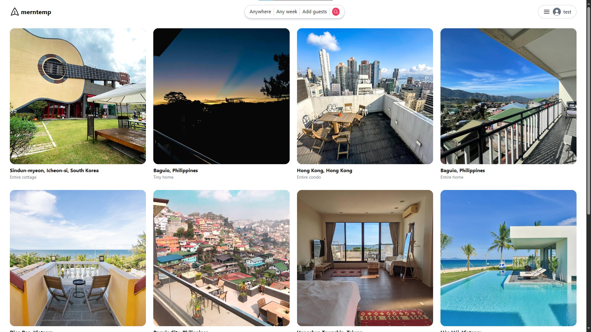
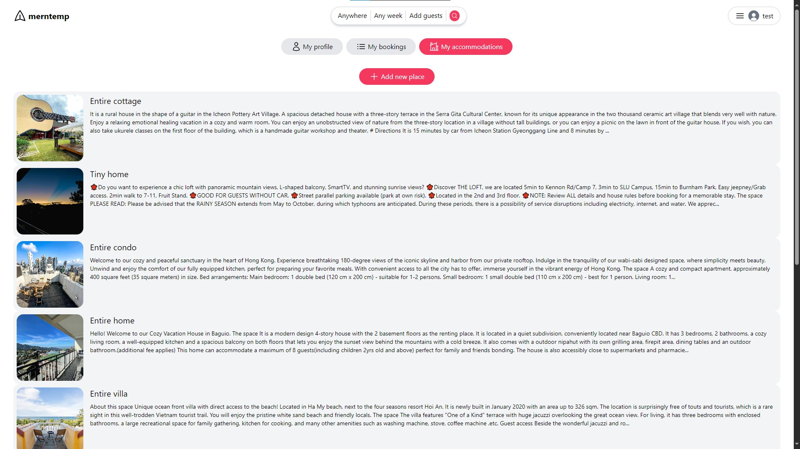
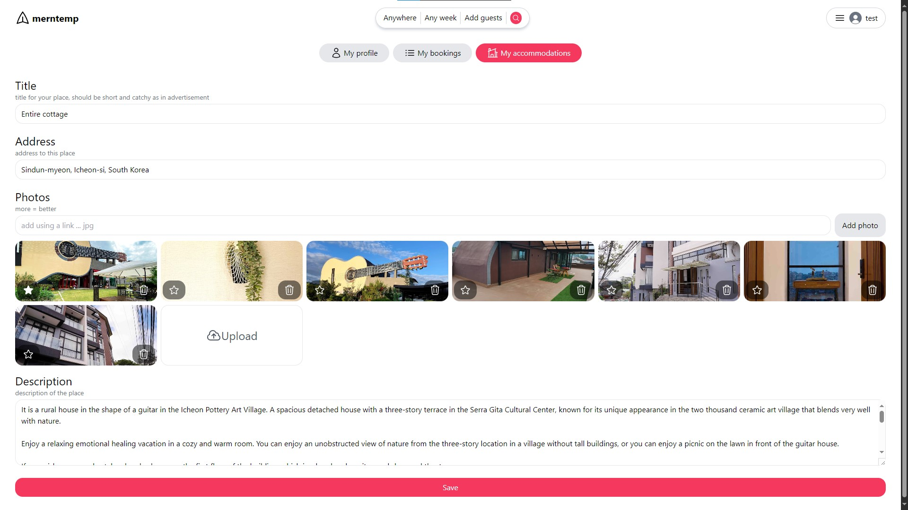

# merntemp
merntemp is a Airbnb clone website to showcase proficiency in the MERN stack\.

## Screenshots

### Places Page

| /places | /places/:id |
|---|---|
||

## Features
- login sytem with authentication using JWT 
- REST API with CRUD operation

## References
- https://www.youtube.com/watch?v=MpQbwtSiZ7E
- https://www.airbnb.com